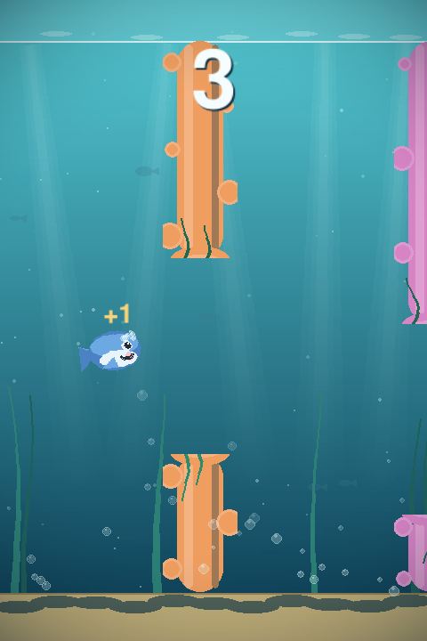
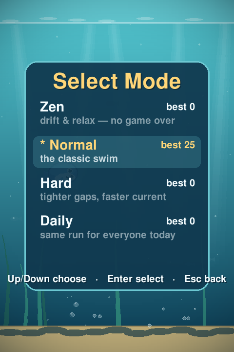
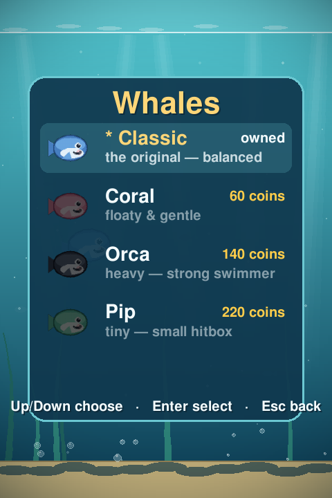
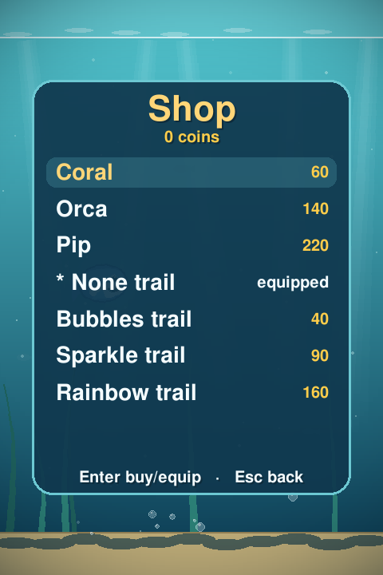

# 🐳 Swimming Tiny Whale

A cute, juicy **Flappy Bird-style** game built in Python + pygame. Guide a chubby
little whale through drifting coral columns in a soft, sun-dappled sea.

All art is drawn procedurally (no image files), so it runs anywhere — and the
core mechanics run headlessly for testing.



## Features

- 🌊 **Living underwater scene** — a deep-teal→aqua gradient, soft god-ray light
  shafts that sway and breathe, drifting plankton, distant parallax fish,
  swaying kelp fronds, and a depth vignette.
- 🐳 **A friendly whale** — chubby and round, with an idle bob, a tail-flap
  animation, velocity-based tilt, a glow halo, and a bubble spout each swim.
- 🐳 **Playable characters** — **Classic**, **Coral** (floaty), **Orca** (heavy),
  and **Pip** (tiny hitbox), each with its own procedural skin *and* feel.
  Unlock with coins.
- 🪸 **Hand-crafted obstacles & hazards** — rounded, knobbly coral columns (some
  that **oscillate** vertically at higher scores), plus **jellyfish**, spiky
  **sea mines**, and **current zones** that shove you around.
- 🎮 **Game modes** — **Zen** (no game over), **Normal**, **Hard** (tighter gaps,
  faster current), and a **Daily** challenge that plays the *same seeded run for
  everyone that day*. Per-mode high scores and leaderboards.
- ⚡ **Power-ups** — **Shield** (absorb one hit), **Slow-mo**, **Magnet** (vacuum
  coins), and **Shrink** (smaller hitbox). Timed, with a HUD indicator.
- 🪙 **Coins & shop** — collect coins mid-run, then spend them to unlock whales
  and cosmetic **trails** (Bubbles / Sparkle / Rainbow).
- ✨ **Juice** — rising bubbles, splash + screen shake + flash on impact, score
  "+1"/"+N" pops, an animated HUD score pop, new-best sparkles, and smooth
  cross-fades between every screen.
- 🏆 **Persistence** — high score, per-mode leaderboards (arcade 3-letter
  initials), coins, unlocks, and selections, all saved locally.
- 🔊 **Optional sound** — swim / score / hit blips synthesised at runtime (no
  audio files), degrading gracefully to silent if there's no audio device.
- 🎯 **60 FPS**, frame-rate-independent physics.

| Modes | Whales | Shop |
|:---:|:---:|:---:|
|  |  |  |

## Controls

| Action                    | Keys / Mouse                     |
|---------------------------|----------------------------------|
| Swim up                   | **Space**, **↑**, **W**, or click |
| Start / restart           | Same swim input                  |
| Pause / resume            | **Esc** or **P** (tap/Space also resumes) |
| Main menu (from game-over)| **Esc**                          |
| Mode select               | **D** (from title)               |
| Character select          | **C** (from title)               |
| Shop                      | **S** (from title)               |
| View leaderboard          | **L** (from title or game-over)  |
| Menu navigation           | **↑ / ↓**, **Enter** select, **Esc** back |
| Enter initials (on board) | Type **A–Z / 0–9**, **Enter** to save, **Backspace** to fix |
| Mute / unmute             | **M**                            |
| Quit                      | **Esc** (from the title), or close the window |

The whale sinks constantly under gentle gravity — tap to give it an upward swim
impulse and thread the gaps. Grab coins and power-ups; dodge jellyfish and mines.
Hitting a column, hazard, the water surface, or the seabed ends the run (unless
you have a shield, or you're in Zen mode).

## Running

Requires **Python 3** and **pygame**. A virtualenv is included; from the project
root:

```bash
# Using the bundled venv
source venv/bin/activate
python main.py
```

Or set up fresh:

```bash
python3 -m venv venv
source venv/bin/activate
pip install pygame
python main.py
```

### Headless / smoke run

The game honours `SDL_VIDEODRIVER=dummy` and can self-exit after N frames, which
is handy on a server with no display:

```bash
SDL_VIDEODRIVER=dummy SDL_AUDIODRIVER=dummy python main.py --frames 120
```

### Headless screenshots

Render any screen to a PNG without a display — handy for docs and visual checks:

```bash
SDL_VIDEODRIVER=dummy python main.py --shot playing docs/gameplay.png --frames 90
SDL_VIDEODRIVER=dummy python main.py --shot charselect docs/charselect.png
# states: title, playing, gameover, leaderboard, modeselect, charselect, shop
```

## Tests

Core logic (physics, collision, scoring, obstacle difficulty, particles,
persistence, and the state machine) is unit-tested **without needing a display**:

```bash
source venv/bin/activate
SDL_VIDEODRIVER=dummy SDL_AUDIODRIVER=dummy python -m pytest -q
```

## Project layout

```
main.py        # entry point, game loop, state machine, all screens, screenshot tool
whale.py       # player entity: physics/feel (per character), tilt, tail-flap, glow
obstacles.py   # coral columns: spawning, scrolling, scoring, collision, oscillation
collectibles.py# coins + power-up pickups: spawn, scroll, magnet, collection
hazards.py     # jellyfish, sea mines, and current zones
powerups.py    # power-up registry + timed-effect manager
particles.py   # bubbles, swim spout, splash, score pop, cosmetic trail
scene.py       # background: gradient, god-rays, parallax layers, vignette
modes.py       # game modes (Zen/Normal/Hard/Daily) + daily seed
characters.py  # whale skins + feel (WhaleSpec registry)
trails.py      # cosmetic trail registry
ui.py          # shared panel / menu drawing helpers
audio.py       # synthesised, gracefully-degrading sound effects
storage.py     # high-score, per-mode leaderboards, and player profile (JSON)
util.py        # small math helpers (clamp, lerp, easing)
config.py      # every tunable constant (physics, colours, sizes, feel, costs)
assets/draw.py # procedural art (whale, coral, coins, power-ups, hazards, god-rays)
tests/         # pytest suite (headless) — 151 tests
```

All gameplay tunables — gravity, swim impulse, gap sizes, speeds, colours, FPS,
mode multipliers, power-up durations, unlock costs — live in `config.py`, so the
feel is easy to tweak in one place.

### Save files (local, git-ignored)

`highscore.json`, `leaderboard.json` (+ `leaderboard_<mode>.json` for non-Normal
modes), and `profile.json` (coins, unlocks, selections, per-mode bests). Delete
them to reset progress.
